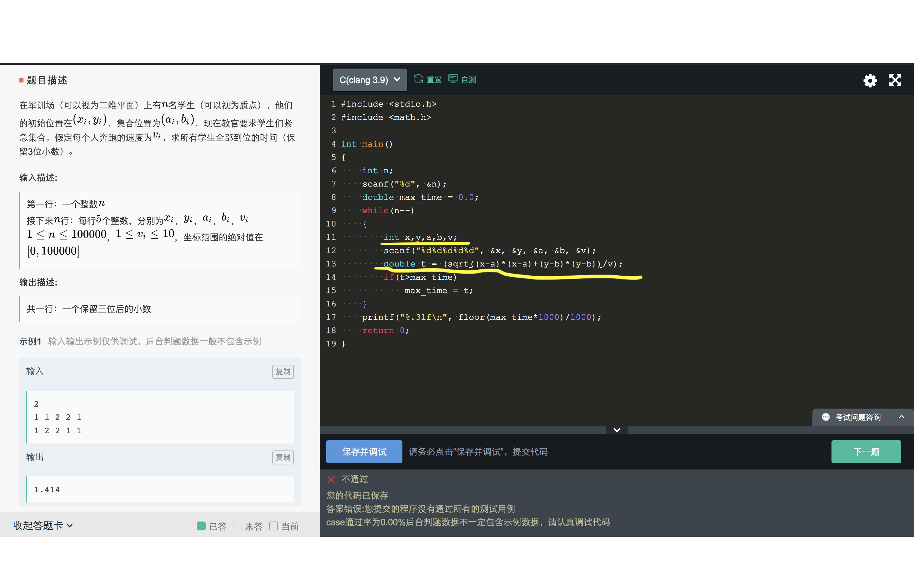

# Chapter 2: Variables and Basic Types

> C++ is a statically typed language, type checking is done at compile time.
> C++是静态类型语言，在编译期间据需要完成类型检查。

在编译期间就需要知道所用变量的类型，这其实是一个很重要的细节要求，在后续的笔记中会着重说明它的具体限制与作用。一个简单的小例子，如果使用过C语言，就知道数组在初始化时：

```c
int a[10] = {0}; // legal
int n;
scanf("%d", &n);
int b[n] = {0}; 
// b cannot be initialized because n cannot be determined when compiling.
```

C++也一样，对于变量的类型要求在编译时就知道。

## 1. Primitive Built-in Types

C++中的内置变量主要包含两部分：`算数类型(Arithmetic Types)` + `void类型`。其中，算数类型指的是字符（characters）， 整形（integers），布尔型（boolean）和浮点型（floating-point）。

### Arithmetic Types: `Integral types` + `Floating-point types`


C/C++中常见的内置类型如图所示，在此需要说明的是后面所示的大小范围为**最小size**。不同类型的数据size指的是`the number of bits in`，这会因为在不同机器上而出现不同的值。例如，在16位机器上`int` 只占2字节(2 byets)，`long`则占4字节(4 bytes)。但是在32位机器上，`int`和`long`都是4字节；在64位机器上，`int`还是4字节，但是`long`则变成了8字节64位。因此，**他们都是机器相关的内置类型，机器不同和编译器不同都会影响到其size（The size varies across machines）**。总结就是在C/C++标准只定义了各种类型的最小size，例如`sizeof(int) <= sizeof(long)`。

图中，`char`也是整形（注意整形(`integral Types`)不是`int`），`char`是和单个机器字节相同尺寸的数据类型(A char is the same size as a single machine byte)。也就是说，`char`占一个字节8位。字节也是最小的内存可寻址单位，通常将存储中最小的存储单位称为`word`，一个`word`一般包含4个字节（32位机器中）或8个字节（64位机器中）。通常一个`floating-point`被认为是一个`word(32 bits)`，一个`double`被认为是2个`word(32 bits)`。

对于整形`integral types`，除了布尔类型都有`signed`和`unsgined`之分。**通常`unsigned int`被简写为`unsigned`。** `signed`类型取值范围为$(-2^{bit-1}, 2^{bit-1}-1)$。例如，`int`的取值范围可以被计算为$(-2^{31}, 2^{31}-1)$。

对于`bool`类型来说，其是C++的标准，只有两个值：非零值为true, 零值为false。注意此时是非零值也是true，也就是说负数如-42也会被判为ture。`BOOL`类型则是VC++（Visual C++）提供的自定义类型，其实际上是**`int`**类型（并不是布尔类型）。只有当`BOOL == 1`时可看作true，当`BOOL == 0`时可看作false。且如果`BOOL x = -100; cout<<x<<endl`的结果为-100； `BOOL x = 30; cout<<x<<endl`的结果为30。

## 2. 类型转换

在这里我们主要强调不同类型的变量进行操作会导致类型转换（Type Conversions），但不涉及具体的类型转换的方法介绍。**因为变量的类型定义了该变量能够存放什么类型的数据以及进行什么样的操作**，所以在对变量进行操作的时候应当注意变量的数据类型是否合适。

### 赋值时强制类型转换

例如，在赋值操作时就会自动产生类型转换：

```c
bool b = 42;  // b is true
int i = b; // i has value 1
i = 3.14; // i has value 3
double pi = i; // pi has value = 3.0
unsigned char c = -1; // assuming 8-bit chars, c has value 255
signed char c2 = 256; // assuming 8-bit chars, c2 has value undefined

```

这里需要注意的是如果给`unsigned type`赋值一个超过范围的值：

- 如果赋值大于`unsigned type`的取值范围：其结果为该值对`unsigned type`的取值范围取模（%）。
- 如果赋值小于`unsigned type`的取值范围：其结果为该值的最大取值范围减掉赋值值。

例如：

```c
unsigned char c = 256;
cout<<c<<endl;  // 0; 256 > 255, c = 256 % 256
c = -1;
cout<<c<<endl; // 255; 
c = -2;
cout<<c<<endl; // 254; c = 255 - 1;
```

当`unsigned char c = -1` 时，其真正的值为255。这是因为二进制在计算机中实际上以补码的形式存在（便于运算）：

- 正数的补码是其本身；
- 负数的补码是其对应正数取反+1；

所以-1的补码 = `0000 0001`(1的二进制表示) 取反+1 --> `1111 1111`(255)。即-1在内存块中存储的值为`1111 1111`。因为`unsigned char`会让编译器在类型转换时以无符号数的规则来解释此块内存，所以最终得到的结果为255。同理，对于-2最终得到的结果为254。

但是如果给`signed type`进行超过范围的赋值，那么其结果是`undefined`：即有可能有效，有可能crash，有可能是任意值。

> **Tips:**
>
> 可以通过`unsigned`来查看某种数据类型的取值范围，只需要将该类型定义为`unsigned`然后初始化为-1。例如`unsigned int i = -1; cout<<i<<endl;`。

### 表达式强制类型转换

当我们在写表达式时，也会进行隐式的(implicitly)类型转换。例如：

```c
unsigned u = 10;  // unsigned int
int i = -42;
cout<<i+i<<endl;  // -84
cout<<u+i<<endl;  // （4294967296 - 42） + 10 = 4294967264
```

当`unsigned u + signed i`时，`signed i`先被转换为`unsigned`，然后与u进行计算。

#### 错误实例1

```c
for(unsigned u=10; u>=0; --u)
  cout<<u<<endl;
```

因为在最后一次循环体执行结束后，此时u=0然后`--u`，则u=-1会被隐式类型转换为4294967295，也就是说此时该循环不会结束。可以使用`while`解决，也可以使用`int`作为循环变量。

#### 错误实例2



在这个实际编程题中，我们首先声明4个坐标变量`x,y,a,b`为`int`型，根据题目描述其取值范围为100000，所以`int`型没问题。但是，当我们在计算两个坐标之间的距离时，也就是在计算`sqrt((x-a)*(x-a) + (y-b)*(y-b))`时，其中间变量`(x-a)*(x-a)`或者`(y-b)*(y-b)`是有可能超过`int`（因为表达式的结果被强制转换为`int`型）型的取值范围的。比如x=100000，a=0，则(100000*100000) > 10^9。所以此时计算得到的值是`undefined`。改正方法就是将`x,y,a,b`都声明为`long long`类型。

另外，在此还需要注意的是`math.h`中的`double sqrt(double x)`函数要求形参为`double`类型，所以此时其实还是发生了类型转换（即将`long long`强制转换为`double`）。